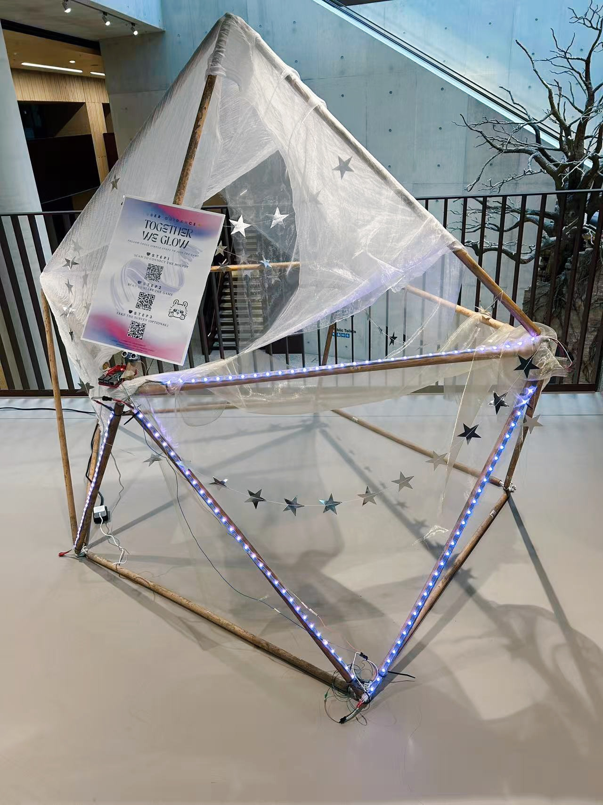
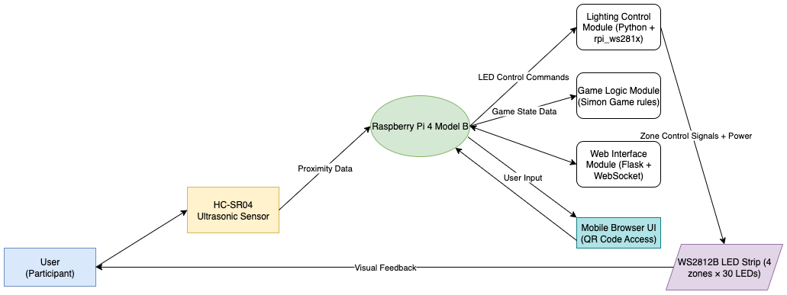
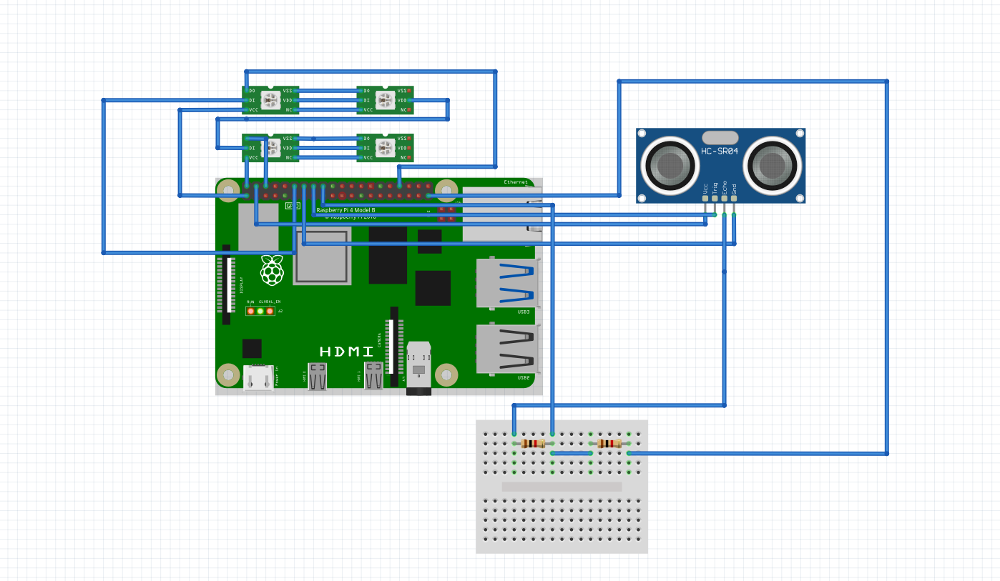
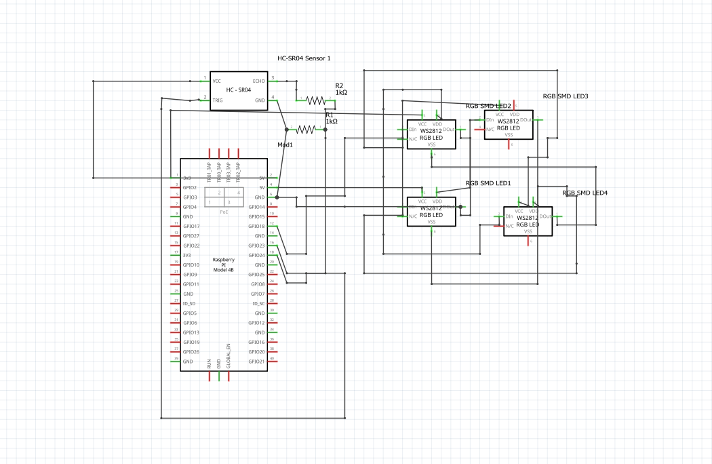
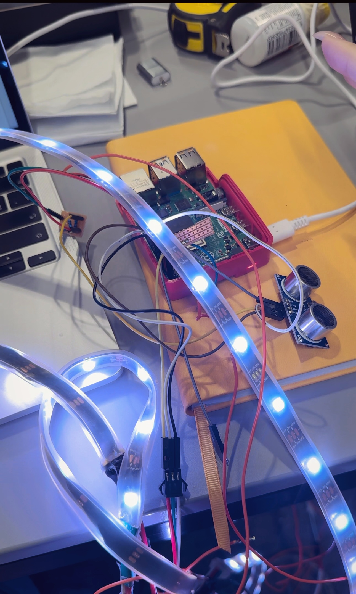
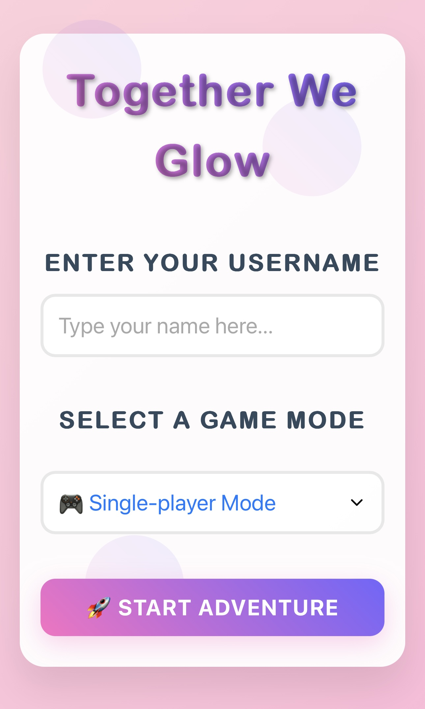
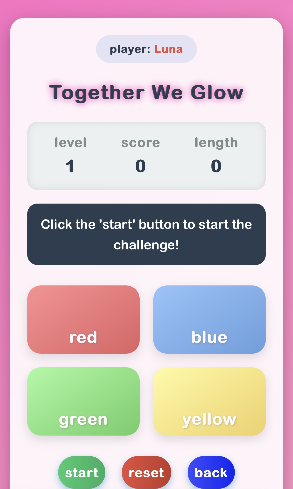

# From Light to Play  
### A Geodesic Dome Installation Combining LED Interaction and Web-Based Memory Games  

  

*This project explores how LED-based interaction and gamification can enhance engagement in shared environments.  
The browser-based memory game integrated into this installation is titled **Together We Glow**.*

---

## What is this project?

This installation combines **LED light strips**, a **geodesic dome-inspired wooden frame**, and a **browser-based memory game** inspired by the classic **Simon Game** (the 1970s electronic memory game with colored buttons).  
It was deployed in a **semi-public indoor exhibition** as a prototype to test how gamification and light-based feedback can sustain engagement and encourage collaboration.

---

## System Architecture

- **Raspberry Pi 4B**: runs Python, Flask, WebSocket  
- **HC-SR04 ultrasonic sensor**: detects proximity  
- **WS2812B LED strips**: 4 zones (red, green, blue, yellow)  
- **Web interface**: mobile browser UI via QR code  

---

## Materials

- Raspberry Pi 4 Model B  
- WS2812B LED strips (4 × 30 LEDs)  
- HC-SR04 ultrasonic sensor  
- Breadboard, jumper wires, resistors (1kΩ × 2)  
- Wooden poles (repurposed broom handles) for the frame  

---

## Circuit Design  

  
  

**Prototype testing**  
  

For reproducibility, the repository also includes a Fritzing project file [`dome_circuit_design.fzz`](dome_circuit_design.fzz), which contains:  

- **Breadboard view** – prototype wiring  
- **Schematic view** – logical circuit diagram  
- **PCB view** – potential printed circuit board layout  

Open with [Fritzing](https://fritzing.org/) to explore or modify the design.  

---

## Web Interface

**Homepage**  
  

**Game**  
  

Players scan a QR code, enter a username, select **single-player or multi-player mode**, and follow the LED sequence in the memory game.

---

## Future Work

Based on feedback and exhibition testing, possible improvements include:  
- Expanding LED coverage to more struts for stronger visual impact  
- Adding **sound cues** for start/success/failure to enrich immersion  
- Optimising system stability and restart functions  
- Implementing **adaptive difficulty** to suit different user groups  
- Testing deployment in larger, public-facing environments  

---
